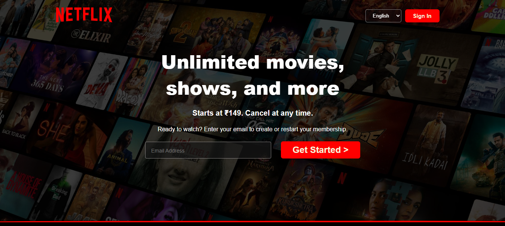

# 🎬 Netflix Clone – Responsive Landing Page

A modern and responsive **Netflix Clone Landing Page** built using pure **HTML & CSS**.  
This project replicates the look and feel of Netflix's homepage with a clean UI and fully responsive layout.

## 📂 GitHub Repository

📁 https://github.com/your-username/netflix-clone  

---

## 🛠️ Technologies Used

- HTML5  
- CSS3  
- Flexbox  
- Media Queries  

---

## ✨ Features

✔ Netflix-style modern UI  
✔ Fully Responsive (Mobile, Tablet, Desktop)  
✔ Hero Section with Background Overlay  
✔ Feature Cards Section  
✔ Clean & Structured Code  
✔ Dark Theme Design  

---

## 📱 Responsive Design

Optimized for:

- 320px Mobile  
- 400px – 600px Mobile  
- Tablet Devices  
- Desktop Screens  

---

## 📸 Preview



---

## 📦 How to Run Locally

```bash
git clone https://github.com/your-username/netflix-clone.git
cd netflix-clone
open index.html